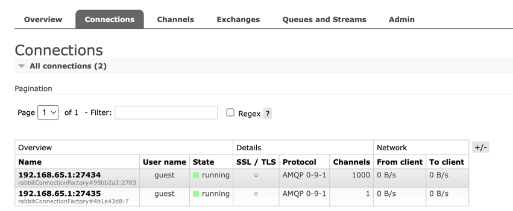

This repository contains code that allows the reproduction of a supposed RabbitMQ connection channel leak issue for `org.springframework:spring-messaging:5.3.23` and `org.springframework.amqp:spring-rabbit:2.4.7` on `rabbitmq-server` with version `3.12.10`.

# Instruction
To reproduce the issue, do the following:

**Build the project:**
```shell
mvn clean install
```

**Run rabbitmq server:**
```shell
docker-compose up
```

**Run consumer:**

Run the `Application.java` with command line arguments: `-Dspring.profiles.active=consumer`.

**Run consumer:**

Run the `Application.java` with command line arguments: `-Dspring.profiles.active=producer`.

**Stop rabbitmq server:**

You can just press `CTRL+C` in the console where you run your docker-compose if you used it without `-d` flag.

**Run rabbitmq server:**

Before running the server again, wait for one minute to guarantee that the issue is going to reproduce. Then run:
```shell
docker-compose up
```

Not you should see error messages in producer logs:
```text
2024-07-19 16:45:45.210  WARN 34769 --- [pool-2-thread-1] .l.DirectReplyToMessageListenerContainer : basicConsume failed, scheduling consumer for queue amq.rabbitmq.reply-to for restart

org.springframework.amqp.AmqpResourceNotAvailableException: The channelMax limit is reached. Try later.
	at org.springframework.amqp.rabbit.connection.SimpleConnection.createChannel(SimpleConnection.java:60) ~[spring-rabbit-2.4.7.jar:2.4.7]
	at org.springframework.amqp.rabbit.connection.CachingConnectionFactory$ChannelCachingConnectionProxy.createBareChannel(CachingConnectionFactory.java:1413) ~[spring-rabbit-2.4.7.jar:2.4.7]
	at org.springframework.amqp.rabbit.connection.CachingConnectionFactory$ChannelCachingConnectionProxy.access$200(CachingConnectionFactory.java:1399) ~[spring-rabbit-2.4.7.jar:2.4.7]
	at org.springframework.amqp.rabbit.connection.CachingConnectionFactory.doCreateBareChannel(CachingConnectionFactory.java:697) ~[spring-rabbit-2.4.7.jar:2.4.7]
	at org.springframework.amqp.rabbit.connection.CachingConnectionFactory.createBareChannel(CachingConnectionFactory.java:680) ~[spring-rabbit-2.4.7.jar:2.4.7]
	at org.springframework.amqp.rabbit.connection.CachingConnectionFactory.getCachedChannelProxy(CachingConnectionFactory.java:650) ~[spring-rabbit-2.4.7.jar:2.4.7]
	at org.springframework.amqp.rabbit.connection.CachingConnectionFactory.getChannel(CachingConnectionFactory.java:540) ~[spring-rabbit-2.4.7.jar:2.4.7]
	at org.springframework.amqp.rabbit.connection.CachingConnectionFactory.access$1600(CachingConnectionFactory.java:100) ~[spring-rabbit-2.4.7.jar:2.4.7]
	at org.springframework.amqp.rabbit.connection.CachingConnectionFactory$ChannelCachingConnectionProxy.createChannel(CachingConnectionFactory.java:1418) ~[spring-rabbit-2.4.7.jar:2.4.7]
	at org.springframework.amqp.rabbit.listener.DirectMessageListenerContainer.consume(DirectMessageListenerContainer.java:761) ~[spring-rabbit-2.4.7.jar:2.4.7]
	at org.springframework.amqp.rabbit.listener.DirectMessageListenerContainer.doConsumeFromQueue(DirectMessageListenerContainer.java:732) ~[spring-rabbit-2.4.7.jar:2.4.7]
	at org.springframework.amqp.rabbit.listener.DirectMessageListenerContainer.adjustConsumers(DirectMessageListenerContainer.java:345) ~[spring-rabbit-2.4.7.jar:2.4.7]
	at org.springframework.amqp.rabbit.listener.DirectMessageListenerContainer.setConsumersPerQueue(DirectMessageListenerContainer.java:172) ~[spring-rabbit-2.4.7.jar:2.4.7]
	at org.springframework.amqp.rabbit.listener.DirectReplyToMessageListenerContainer.getChannelHolder(DirectReplyToMessageListenerContainer.java:175) ~[spring-rabbit-2.4.7.jar:2.4.7]
	at org.springframework.amqp.rabbit.core.RabbitTemplate.doSendAndReceiveWithDirect(RabbitTemplate.java:1966) ~[spring-rabbit-2.4.7.jar:2.4.7]
	at org.springframework.amqp.rabbit.core.RabbitTemplate.doSendAndReceive(RabbitTemplate.java:1856) ~[spring-rabbit-2.4.7.jar:2.4.7]
	at org.springframework.amqp.rabbit.core.RabbitTemplate.convertSendAndReceiveRaw(RabbitTemplate.java:1824) ~[spring-rabbit-2.4.7.jar:2.4.7]
	at org.springframework.amqp.rabbit.core.RabbitTemplate.convertSendAndReceive(RabbitTemplate.java:1690) ~[spring-rabbit-2.4.7.jar:2.4.7]
	at org.springframework.amqp.rabbit.core.RabbitTemplate.convertSendAndReceive(RabbitTemplate.java:1642) ~[spring-rabbit-2.4.7.jar:2.4.7]
	at org.springframework.amqp.rabbit.core.RabbitTemplate.convertSendAndReceive(RabbitTemplate.java:1634) ~[spring-rabbit-2.4.7.jar:2.4.7]
	at com.example.rabbitmqtest.MessageSendingTask.sendMessage(MessageSendingTask.java:27) ~[classes/:na]
	at com.example.rabbitmqtest.MessageSendingTask.run(MessageSendingTask.java:20) ~[classes/:na]
	at java.base/java.util.concurrent.Executors$RunnableAdapter.call(Executors.java:515) ~[na:na]
	at java.base/java.util.concurrent.FutureTask.run$$$capture(FutureTask.java:264) ~[na:na]
	at java.base/java.util.concurrent.FutureTask.run(FutureTask.java) ~[na:na]
	at java.base/java.util.concurrent.ThreadPoolExecutor.runWorker(ThreadPoolExecutor.java:1128) ~[na:na]
	at java.base/java.util.concurrent.ThreadPoolExecutor$Worker.run(ThreadPoolExecutor.java:628) ~[na:na]
	at java.base/java.lang.Thread.run(Thread.java:829) ~[na:na]
```

And in rabbitmq interface (you can reach it by opening `localhost:15672` in browser and logging in with `guest`/`guest` credentials) you will see that the connection reached the channels limit of 1000 (that is set in `rabbitmq.conf`):


